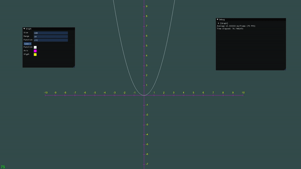

# Graph
Mathematical function graph renderer  
(with simplistic GUI interface, rendered using ImGui).



That's quite unprofessional of me to say, but sorry if it doesn't build correctly (if at all).  
I'm quite new to premake and in general making the build process easier.  
As a side note, it works flawlessly on Windows and Ubuntu.

# Prerequisites

* Libraries
    * [MuParser](https://beltoforion.de/en/muparser/building.php)
    * [FreeType](https://freetype.org/download.html)
    * [GLFW](https://www.glfw.org/download.html)

# Building

In order to build the repository, you will require [GNU Make](https://www.gnu.org/software/make/) and [Premake](https://premake.github.io/download) version 5.0 or higher.

```
premake5 gmake
make GraphApp config=Release
./GraphApp
```
